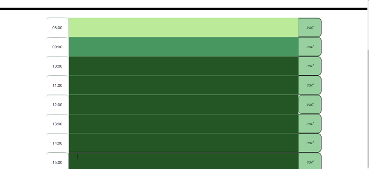

# work-day-scheduler
The objective of this project was to create an interactive schedule for a single day. 

-Time, and date are indicated in the pages header for easy access.

-Each row will indicate whether or not the allotted time is in the past, present, or future by the background color. 

-After an item is added to a row, it will be saved in the local storage in order to keep contents on the page after a page reload.

## Process
This project was built with starter code, bootstrap, and moment.js. I used Jquery, and Javascript in order to make it interactive and up to performance standards. 

## Links
Deployed site: https://d-dursty.github.io/work-day-scheduler/

Repository link: https://github.com/D-Dursty/work-day-scheduler

## Screenshots

## Credits
Site built by Devon Durst, September 2022, with assistance from Moment.js, Bootstrap, and starter code by Trilogy 